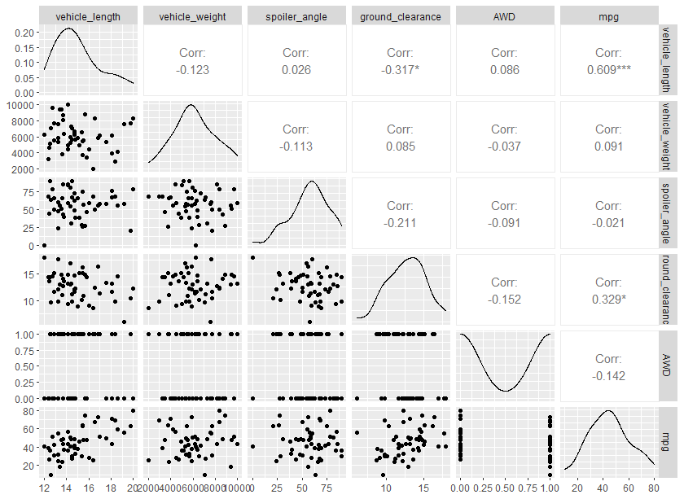
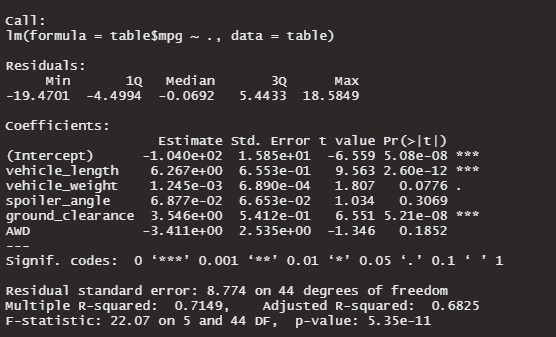
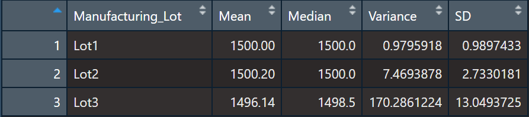
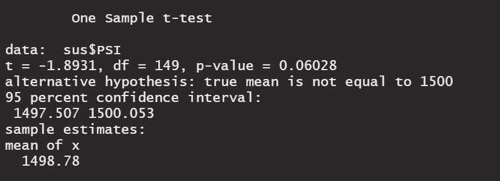
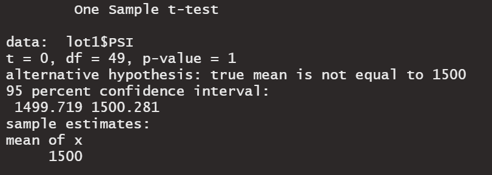
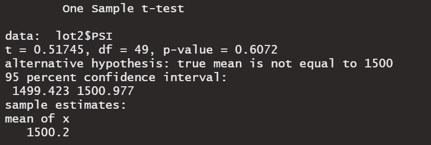
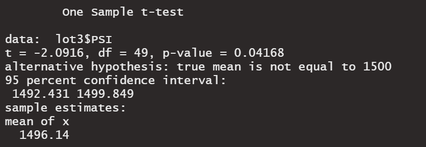

# Results

## Linear Regression to Predict MPG
Data from 50 prototypes were collected. Linear regression was performed to produce a linear model for predicting mpg based on its vehicle length, weight, spoiler angle, drivetrain and ground clearance. 
Upon initial visualization of the individual relationships between each predictor and mpg (as seen below), we can see that vehicle length and ground clearance are positively related to a vehicle's mpg by significant degrees. 

Multiple linear regression was performed next to produce a linear model for predicting mpg from all measured variables. The output is shown below. 

As expected from our visualization, both vehicle length ( t = -6.56, p < .001) and ground clearance ( t = 6.55, p < .001)provided a non-random amount of variance in mpg. 

In this instance, the slope of the linear model is not considered to be zero; there are different slopes presented for each variable; however, most predictors produce a linear model with a positive slope of values sufficient for outweighing the negative slopes of the only predictor for whom the slope of their linear model is negative (AWD). 

All in all, this linear model is able to predict 68.25% of the variation in mpg if a MechaCar prototype. This is a significant amount (R^2 = 0.683, p < .001), as such, the model is effective. 

## Summary Statistics on Suspension Coils
Across the three production lots, the average suspension coil was able to withstand 1498.78 lbs per square inch. The summary table below shows that the distribution of these capacities overall held a normal distribution (Mean = 1498.78, Median = 1500); however, there was a notable degree of variance within the overall sample (62.29). The MechaCar suspension coils' design specifications dictate that the suspension coils' variance must not exceed 100 pounds per square inch. As such, this high variance was a cause for concern and warranted a closer look at each lot included in our sample. 

When looking at the aggregation of each lot subset individually, it becomes clear that the high variance in our overall summary was due to the variance in coils produced in manufacturing lot 3. While lot 1 (0.98) and 2 (7.47)  meet the design specification, as does the average of all lots combined (62.29), the variance in lot 3 (170.29) does not meet this requirement and requires correction. 

## T-Tests on Suspension Coils

Overall, all manufacturing was just barely statistically similar to the population mean of 1,500 pounds per square inch when using an alpha level of .05 (t(149) = -1.89, p = 0.06). As such, when the data of all three lots were aggregated, their coils would just barely manage to pass inspection (seen below). 

When breaking down our sample into subsets for each lot, however, this story changes. Results fall in line with our previous descriptive analytics, which found variance to be much smaller for lots 2 and 1. In addition to less variance, their means did not significantly differ from the population mean of 1,500 pounds per square inch, as seen below for lot 1 (t(49) = 0, p = 1)...

and Lot 2 (t(49) = 0.52, p = 0.61)...

For the coils tested in lot 3, the measured mean did significantly differ from the population mean when testing with an alpha value of .05 (t(49) = -2.09, p < .05). This accounts for the insignificant yet notable difference between the ungrouped sample and the population mean. 

In the box plots below, you can see how the PSI of lot 3 differs from that of lots 1 and 2 in both mean and spread. 

## Study Design: MechaCar vs Competition
In order to quantify how MechaCar stands up against its competition, I believe it would be beneficial to compare the city and highway fuel efficiency (km/L) of the MechaCar vehicles against each vehicle's two major competitors. For example, should MechaCar release a budget-friendly sedan, the average km/L for a sample of this vehicle would be tested against samples of the two budget-friendly sedans that are closest to MechaCar's in specs and target market. 

In this case, the null hypothesis would be that there is no significant difference in the mean fuel efficiency (km/L) of MechaCar's sedan and those of its two competitors. The alternative hypothesis would be that the mean km/L for the sample of MechaCar sedans is significantly different than the mean km/L for competitor one and competitor two. 

The statistical test ideal for testing this hypothesis is a one-way ANOVA which can be carried out easily with R. To test this, we will require data on the fuel efficiency of sufficiently large samples of MechCar automobiles and the same for each car's greatest competitor from which the mean fuel efficiency can be measured and compared. 